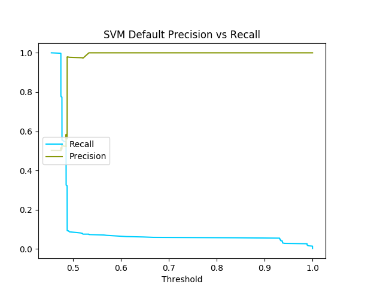

# Machine learning for fraud detection.

## Classifier comparisions

| Classifier | Parameters | Prec Recall curves |
:-----------:|:----------:|:------------------:
| SVM		 | Default	  |  |
| Random Forest | Default |   |
| Random Forest | {'bootstrap': False, 'min_samples_leaf': 1, 'n_estimators': 400, 'max_features': 'auto', 'min_samples_split': 5, 'max_depth': 90} |  |
| Gradient Boost| Default |   |
| Gradient Boost|  {'learning_rate': 0.05, 'min_samples_leaf': '0.4', 'n_estimators': 1200, 'max_features': None, 'min_samples_split': '0.1', 'max_depth': 90} |  |
| Gradient Boost| {'learning_rate': 0.05, 'min_samples_leaf': 0.4, 'n_estimators': 1200, 'min_samples_split': 0.05, 'max_features': None, 'max_depth': 80} |  |
| Logistic Regression (Complete dataset) | Default |  |

## Parameter tuning

### RandomSearchCV RandomForestClassifier
* `{'bootstrap': False, 'min_samples_leaf': 1, 'n_estimators': 400, 'max_features': 'auto', 'min_samples_split': 5, 'max_depth': 90}`

### RandomSearchCV GradientBoostingClassifier
* `{'learning_rate': 0.05, 'min_samples_leaf': '0.4', 'n_estimators': 1200, 'max_features': None, 'min_samples_split': '0.1', 'max_depth': 90}`

### GridSearchCV fine-tuning GradientBoostingClassifier
* `{'learning_rate': 0.05, 'min_samples_leaf': 0.4, 'n_estimators': 1200, 'min_samples_split': 0.05, 'max_features': None, 'max_depth': 80}`